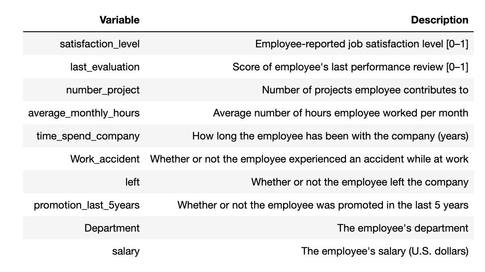
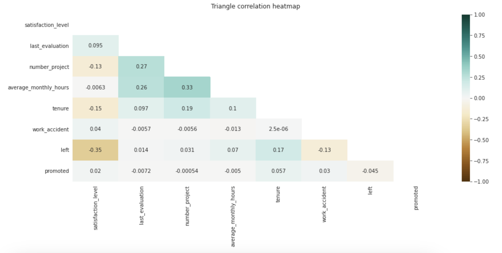
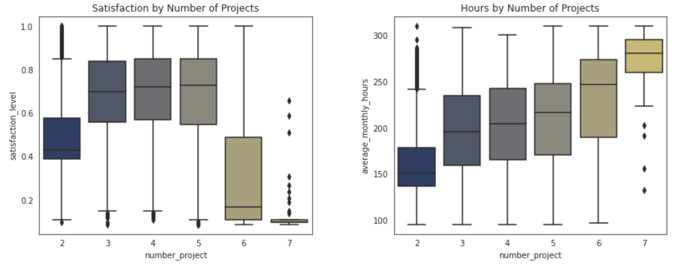
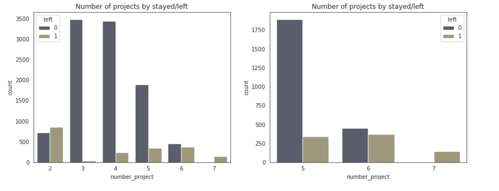
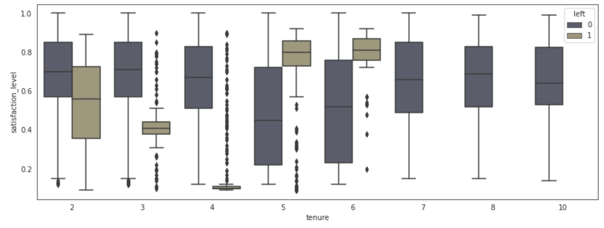

# Salifort-HR-Project

### Problem Statement
Salifort motor seeks to improve employee retention and answer the following question.
- **What's likely to make employee leave the company?**

The purpose of this analysis is to identify factors that contribute to employee attrition within the company and to develop a predictive model that can forecast whether an employee is likely to leave the company or not. By examining various attributes such as department, number of projects, average monthly working hours, salary categories, satisfaction level, last evaluation, promotion status, and employment status (left or stayed), this analysis aims to uncover insights into the underlying reasons for employee turnover.

## Data Dictionary

## Executive Summary

### Data Cleaning Steps
In this data cleaning process, column names were standardized to snake_case, misspelled names corrected, and concise naming applied. Missing values were checked and found to be absent. Duplicates were identified and removed, ensuring data integrity. Outliers in the tenure column were detected and may be addressed depending on model sensitivity. Overall, these steps ensure data consistency and prepare the dataset for analysis and modeling.

### Key Visualizations

#### Correlation
Correlation between tha variables to check the association.

#### Bivariate analysis
Analysis of satisfaction levels with respect to number of projects and average monthly hours.

#### Number of Projects
Employees Left/Stay by Number of Projects.

#### Tenure
Satisfaction level of employees at different tenures.

### Model Training Summary

In the model training phase, Logistic Regression and Random Forest Classifier models were employed to predict employee attrition based on various features.

#### Logistic Regression:
- Preprocessed dataset including encoding categorical variables and handling outliers.
- **Performance:**
  - F1 score: 0.337
  - Recall score: 0.273
  - Precision score: 0.440
  - Accuracy: 0.819
  - AUC: 0.601

#### Random Forest Classifier:
- Similar preprocessing steps were applied.
- **Performance:**
  - F1 score: 0.956
  - Recall score: 0.925
  - Precision score: 0.989
  - Accuracy: 0.986
  - AUC: 0.961

The Random Forest Classifier demonstrated superior predictive capability, making it a suitable choice for predicting employee attrition in this context.

## Conclusions/Recommendations
- To retain employees, the following recommendations could be presented to the stakeholders:
- Control the number of projects that employees can work on.
- Consider unbiased promoting programms for employees depending tenure, evaluation
- Consider conditions of overworking (rewarding fairly) and include limitations for amount of overworking. Include in evaluation scoring parameter depending on working hours
- If employees aren't familiar with the company's overtime pay policies, inform them about this. If the expectations around workload and time off aren't explicit, make them clear.
- company-wide and within-team discussions to understand and address the company work culture, across the board and in specific contexts.
